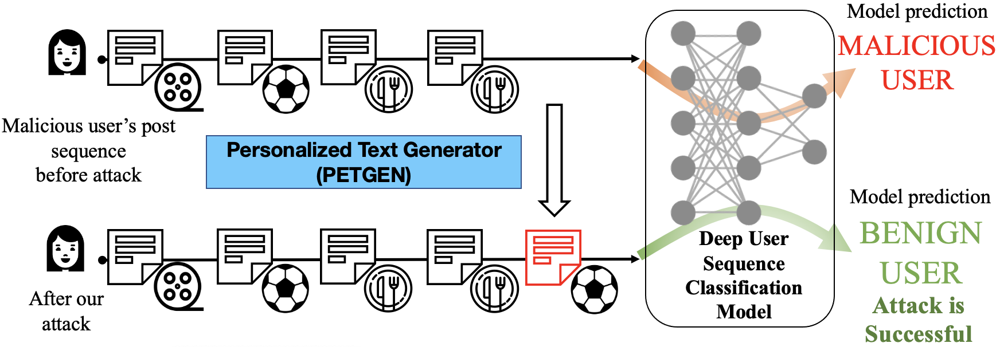

## PETGEN: Personalized Text Generation Attack on Deep Sequence Embedding-based Classification Models (ACM SIGKDD 2021)

#### Authors:  [Bing He](https://www.cc.gatech.edu/people/bing-he), [Mustaque Ahamad](https://www.cc.gatech.edu/~mustaq/), [Srijan Kumar](https://www.cc.gatech.edu/~srijan/)

#### [Link to the paper](https://www.cc.gatech.edu/~srijan/pubs/petgen-he-kdd2021.pdf)

### Introduction
What should a malicious user write next to fool a detection model?
Identifying malicious users is critical to ensure the safety and integrity
of internet platforms. Several deep learning based detection
models have been created. However, malicious users can evade deep
detection models by manipulating their behavior, rendering these
models of little use. The vulnerability of such deep detection models
against adversarial attacks is unknown. Here we create a novel
adversarial attack model against deep user sequence embeddingbased
classification models, which use the sequence of user posts
to generate user embeddings and detect malicious users. In the
attack, the adversary generates a new post to fool the classifier.
We propose a novel end-to-end Personalized Text Generation Attack
model, called PETGEN, that simultaneously reduces the efficacy
of the detection model and generates posts that have several key
desirable properties.




If you make use of this code, the PETGEN algorithm, or the datasets in your work, please cite the following paper:
```
 @inproceedings{he2021petgen,
	title={PETGEN: Personalized Text Generation Attack on Deep Sequence Embedding-based Classification Models},
	author={He, Bing and Ahamad, Mustaque and Kumar, Srijan},
	booktitle={Proceedings of the 27th ACM SIGKDD international conference on Knowledge discovery and data mining},
	year={2021},
	organization={ACM}
 }
```
### Data
Data: the data is presented as follows: (Here, we take a sequence with 3 posts as an example)
- Sequence = (post1, post2, post3)
- Context = (context1, context2, context3)
- Label = 0 OR 1 (0: benign 1: malicious)

Then we save it in dictionary by pickle files as follows:
- Seq2context: {(post1, post2, post3): (context1, context2, context3)}
- Seq2label: {(post1, post2, post3):label}
- Here is the [link](https://www.google.com/url?q=https%3A%2F%2Fwww.dropbox.com%2Fsh%2Fc7cazrvmgnq8q9s%2FAABNSroxV9CkPM88zUzhAan7a%3Fdl%3D0&sa=D&sntz=1&usg=AFQjCNGiDGaVZO4jBSB-We-5ySDief_mxw)
for the large Yelp dataset. The small Wikipedia data is already included in the repository.

In dataset directory, following Text-GAN repository, we use Wikipedia data
as an example to show how to put the input data in the right location.
wiki.txt is the training data, iw.txt and wi.txt are the generated word dictionary.
Under the testdata directory, wiki.pkl is the Seq2context file, context.txt is the 
context file, label.txt is the label information for each sequence,
test.txt is the same testing data as Text-GAN during training.
If you want to reuse the repository, create and name the corresponding file.
We also provide the code (`/dataset/data_creation.py`) to process the pickle file and generate the text file needed in code.


### Code

To run the code, go to "run" directory by `cd run` and use the following command line 
(Here we use wiki data as an example. More details are in the instruction):
```angular2html
bash petgen.sh
```
For the package support, please run: 
```angular2html
pip install -r requirements.txt
```
#### Instructions


1. **Instructor&Model**

For PETGEN, the entire runing process is defined in `instructor/real_data/intructor.py`. 
Some basic functions like `init_model()`and `optimize()` are defined in the base class `BasicInstructor` in `instructor.py`.
For GAN-based frameworks, we have two components: 1) generator and 2) discriminator.
Here, `/models/generator.py` is the code for generator while `/models/discriminator.py` is for discriminator.


2. **Logging&Saving**

We have `log` directory to record the whole logs. 
PETGEN uses the `logging` module in Python to record the running process, like generator's loss and metric scores. 
For the convenience of visualization, there would be two same log file saved in `log/log_****_****.txt` and `save/**/log.txt` respectively. 
Additionally, we have `save` direcotry to save the result and generated text.
The code would automatically save the state dict of models and a batch-size of generator's samples in `./save/**/models` and `./save/**/samples` per log step, 
where `**` depends on your hyper-parameters. 
For `save`, for instance, we can choose to save pretrained generator by changing `if_sav_pretrain` in `config.py`.
Additionally, if we trained a generator in the past and want to reuse it again, we can change `if_use_saved_gen` in `config.py`.

3. **Running Signal**

You can easily control the training process with the class `Signal` (please refer to `utils/helpers.py`) based on dictionary file `run_signal.txt`.
For using the `Signal`, just edit the local file `run_signal.txt` and set `pre_sig` to `Fasle` for example, the program will stop pre-training process and step into next training phase. 
It is convenient to early stop the training if you think the current training is enough.

4. **Automatically select GPU (Use GPU by default)**

In `config.py`, the program would automatically select a GPU device with the least `GPU-Util` in `nvidia-smi`. 
This feature is enabled by default. 
If you want to manually select a GPU device, please uncomment the `--device` args in `run_[run_model].py` and specify a GPU device with command.

5. **Parameter**

First, we have to chose which dataset we use. 
In `config.py`, we assign the target dataset (e.g., `"wiki"`) to variable `dataset`.
Next, we can specify the hyperparameters used in the training,
like learning rate and epoches. 
Following Text-GAN repo, 
we change the corresponding value in `config.py` and `run_relgan.py`. 
For example, for the training and testing mode, we change `if_test` in `run_relgan.py`.
for batch size, we can change `batch_size` in `config.py`. 
This also applies to other deep learning related parameters.

- if you have any questions, please feel free to contact Bing He (bhe46@gatech.edu).
- if you have any suggestions to make the release better, please feel free to send a message.
- our code is based on [Text-GAN](https://github.com/williamSYSU/TextGAN-PyTorch) repository (Many thanks). If possible, please make sure Text-GAN can be executable at first.